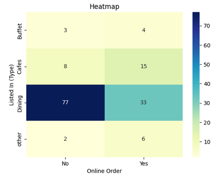

# 🍴 Zomato Data Analysis Using Python

## 📖 Overview
This repository contains a company-standard implementation of **Exploratory Data Analysis (EDA)** on Zomato’s restaurant dataset.  
The analysis highlights key insights into customer preferences, restaurant trends, and business opportunities by examining:  
- Online vs offline ordering behavior  
- Popular restaurant categories  
- Cost preferences for couples  
- Rating distributions and voting trends  

The project uses **Python** and industry-standard libraries: **Pandas, NumPy, Matplotlib, and Seaborn**.

---

## 📂 Repository Structure
```

├── data/                   # Dataset files (CSV)
├── notebooks/              # Jupyter/Colab notebooks
├── docs/                   # Documentation & visualizations
├── LICENSE                 # License information
├── README.md               # Project documentation

````

---

## ⚙️ Prerequisites
- Python **3.8+**  
- Jupyter Notebook or Google Colab  
- Recommended: Virtual environment for dependencies  


---

## 🚀 Getting Started

### 1. Clone the repository

```
zomato-data-analysis-using-python/notebooks/pythoncode/
```

Here’s the full clone and navigation code:

```bash
# Clone the repository
git clone https://github.com/Rasheeda-Sultana/zomato-data-analysis-using-python.git

# Move into the project folder
cd zomato-data-analysis-using-python

# Navigate to the python script inside notebooks
cd notebook
```

### 2. Prepare the dataset

Place the dataset file `Zomato-data-.csv` inside the `data/` folder.

### 3. Run the notebook

```bash
jupyter notebook notebooks/zomato_python_analysis.ipynb
```

### 4. Execute the workflow

Run all notebook cells sequentially to perform:

* Data cleaning
* Visual exploration
* Insights generation

---

## 📊 Key Analysis Performed

* **Data Cleaning & Preparation** – handled missing values and standardized ratings
* **Restaurant Type Exploration** – analyzed common dining categories
* **Votes by Category** – measured customer preferences across restaurant types
* **Most Voted Restaurant** – identified the top restaurant by popularity
* **Online vs Offline Orders** – assessed online order acceptance
* **Rating Distribution** – histogram analysis of customer ratings
* **Couple Cost Preferences** – identified price ranges for two-person dining
* **Online vs Offline Ratings** – compared customer satisfaction
* **Order Mode vs Type Heatmap** – mapped relationship between order mode and restaurant type

---

## 🖼️ Sample Visualizations

### Restaurant Types Distribution


### Online vs Offline Orders


### Heatmap of Order Mode vs Restaurant Type



---

## 🛠️ Tech Stack

* **Python 3.8+**
* **Pandas & NumPy** – Data processing and analysis
* **Matplotlib & Seaborn** – Visualization and reporting
* **Jupyter Notebook / Colab** – Interactive development environment

---

## 📌 Future Enhancements

* Automate ingestion of live datasets from APIs
* Apply advanced statistical and machine learning models
* Deploy interactive dashboards via Power BI / Streamlit

---

## 🏷️ Tags

`#Python` `#DataAnalysis` `#EDA` `#Zomato` `#Pandas` `#Visualization` `#Seaborn` `#Matplotlib`

---

## 🛡️ License

This project is licensed under the [MIT License](LICENSE). You are free to use, modify, and share this project with proper attribution.

## 🌟 About Me

Hi there! I'm **Rasheeda Sultana**. I’m a fresher in Data Analytics and passionate learner on a mission to share knowledge to help others learn and make working with data enjoyable and engaging!
📧 Contact: [your.email@example.com](mailto:your.email@example.com)

```
```
